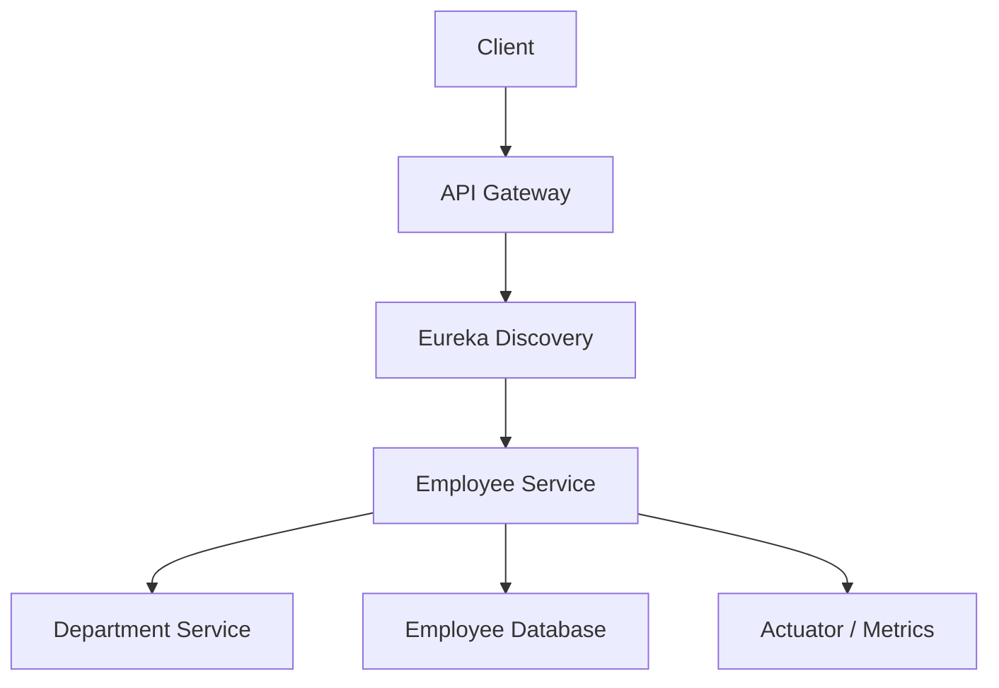

# Spring Boot Microservices Patterns Reference

This document covers the important Spring Boot microservices patterns:

- Eureka Server and Client
- Spring Cloud Gateway
- Spring Cloud Config Server and Client
- RestClient with LoadBalancer
- OpenFeign
- Resilience4j
- Actuator


---

## 1. Spring Cloud Dependency Management

In a Spring Boot microservices project, use the Spring Cloud BOM so all Spring Cloud dependencies are version-compatible.

```xml
<properties>
    <java.version>17</java.version>
    <spring-cloud.version>2023.0.3</spring-cloud.version>
</properties>

<dependencyManagement>
    <dependencies>
        <dependency>
            <groupId>org.springframework.cloud</groupId>
            <artifactId>spring-cloud-dependencies</artifactId>
            <version>${spring-cloud.version}</version>
            <type>pom</type>
            <scope>import</scope>
        </dependency>
    </dependencies>
</dependencyManagement>
```

---

## 2. Eureka Server

Eureka Server is used for service discovery.

Instead of hardcoding service URLs like:

```text
http://localhost:8081
```

other services can call:

```text
http://employee-service
```

Eureka knows which instance of `employee-service` is running.

### Dependency

```xml
<dependency>
    <groupId>org.springframework.cloud</groupId>
    <artifactId>spring-cloud-starter-netflix-eureka-server</artifactId>
</dependency>
```

### Main Class

```java
package com.example.eurekaserver;

import org.springframework.boot.SpringApplication;
import org.springframework.boot.autoconfigure.SpringBootApplication;
import org.springframework.cloud.netflix.eureka.server.EnableEurekaServer;

@EnableEurekaServer
@SpringBootApplication
public class EurekaServerApplication {

    public static void main(String[] args) {
        SpringApplication.run(EurekaServerApplication.class, args);
    }
}
```

### application.yml

```yaml
server:
  port: 8761

spring:
  application:
    name: eureka-server

eureka:
  client:
    register-with-eureka: false
    fetch-registry: false

  server:
    enable-self-preservation: true
```

### Important Properties

| Property | Meaning |
|---|---|
| `register-with-eureka: false` | Eureka server should not register itself as a client |
| `fetch-registry: false` | Eureka server does not need to fetch registry from another Eureka server |
| `enable-self-preservation: true` | Prevents Eureka from removing services too aggressively during temporary network issues |

---

## 3. Eureka Client

Every microservice that wants to register with Eureka should use Eureka Client.

Example services:

```text
employee-service
department-service
order-service
api-gateway
```

### Dependency

```xml
<dependency>
    <groupId>org.springframework.cloud</groupId>
    <artifactId>spring-cloud-starter-netflix-eureka-client</artifactId>
</dependency>
```

### application.yml

```yaml
server:
  port: 8081

spring:
  application:
    name: employee-service

eureka:
  client:
    service-url:
      defaultZone: http://localhost:8761/eureka
    register-with-eureka: true
    fetch-registry: true

  instance:
    prefer-ip-address: true
```

### Important Point

This name is very important:

```yaml
spring:
  application:
    name: employee-service
```

Other services will call it like this:

```java
http://employee-service/api/v1/employees
```

---

## 4. API Gateway

API Gateway is the single entry point for clients.

Client should not directly call:

```text
employee-service
department-service
order-service
```

Instead, client calls:

```text
api-gateway
```

Then Gateway routes the request to the correct service.

### Dependency

```xml
<dependency>
    <groupId>org.springframework.cloud</groupId>
    <artifactId>spring-cloud-starter-gateway</artifactId>
</dependency>
```

For Eureka discovery with Gateway:

```xml
<dependency>
    <groupId>org.springframework.cloud</groupId>
    <artifactId>spring-cloud-starter-netflix-eureka-client</artifactId>
</dependency>
```

### Gateway application.yml

```yaml
server:
  port: 8080

spring:
  application:
    name: api-gateway

  cloud:
    gateway:
      routes:
        - id: employee-service-route
          uri: lb://employee-service
          predicates:
            - Path=/employees/**
          filters:
            - StripPrefix=1
            - AddRequestHeader=X-Gateway-Source, spring-cloud-gateway

        - id: department-service-route
          uri: lb://department-service
          predicates:
            - Path=/departments/**
          filters:
            - StripPrefix=1

eureka:
  client:
    service-url:
      defaultZone: http://localhost:8761/eureka
    register-with-eureka: true
    fetch-registry: true
```

### How Gateway Routing Works

Client calls:

```text
GET http://localhost:8080/employees/api/v1/employees/1
```

Gateway removes `/employees` because of:

```yaml
StripPrefix=1
```

Then forwards the request to:

```text
http://employee-service/api/v1/employees/1
```

Because of:

```yaml
uri: lb://employee-service
```

Gateway uses Eureka and Spring Cloud LoadBalancer to find a running instance of `employee-service`.

### Java-Based Gateway Route

```java
package com.example.gateway.config;

import org.springframework.cloud.gateway.route.RouteLocator;
import org.springframework.cloud.gateway.route.builder.RouteLocatorBuilder;
import org.springframework.context.annotation.Bean;
import org.springframework.context.annotation.Configuration;

@Configuration
public class GatewayRouteConfig {

    @Bean
    public RouteLocator customRoutes(RouteLocatorBuilder builder) {
        return builder.routes()

                .route("employee-service-route", r -> r
                        .path("/employees/**")
                        .filters(f -> f
                                .stripPrefix(1)
                                .addRequestHeader("X-Gateway-Source", "spring-cloud-gateway")
                        )
                        .uri("lb://employee-service")
                )

                .route("department-service-route", r -> r
                        .path("/departments/**")
                        .filters(f -> f.stripPrefix(1))
                        .uri("lb://department-service")
                )

                .build();
    }
}
```

Use either YAML-based routing or Java-based routing.

For most projects, YAML is simpler and cleaner.

---

## 5. Spring Cloud Config Server

Config Server is used for centralized configuration.

Instead of putting configuration inside every service, you can keep configs in:

- Git repository
- Local file system
- Central config server

Then every microservice loads its config from Config Server.

### Config Server Dependency

```xml
<dependency>
    <groupId>org.springframework.cloud</groupId>
    <artifactId>spring-cloud-config-server</artifactId>
</dependency>
```

### Main Class

```java
package com.example.configserver;

import org.springframework.boot.SpringApplication;
import org.springframework.boot.autoconfigure.SpringBootApplication;
import org.springframework.cloud.config.server.EnableConfigServer;

@EnableConfigServer
@SpringBootApplication
public class ConfigServerApplication {

    public static void main(String[] args) {
        SpringApplication.run(ConfigServerApplication.class, args);
    }
}
```

### Config Server Using Git

```yaml
server:
  port: 8888

spring:
  application:
    name: config-server

  cloud:
    config:
      server:
        git:
          uri: https://github.com/your-org/config-repo.git
          username: your-username
          password: your-token
          default-label: main
          clone-on-start: true
          force-pull: true
```

For GitHub, use a personal access token, not your normal password.

### Config Server Using Local File System

```yaml
server:
  port: 8888

spring:
  application:
    name: config-server

  profiles:
    active: native

  cloud:
    config:
      server:
        native:
          search-locations: file:///D:/config-repo
```

For Linux/Mac:

```yaml
spring:
  cloud:
    config:
      server:
        native:
          search-locations: file:///home/user/config-repo
```

### Config Client Dependency

Every microservice that reads config from Config Server needs this:

```xml
<dependency>
    <groupId>org.springframework.cloud</groupId>
    <artifactId>spring-cloud-starter-config</artifactId>
</dependency>
```

### Config Client application.yml

Example: `employee-service`

```yaml
spring:
  application:
    name: employee-service

  config:
    import: optional:configserver:http://localhost:8888
```

The Config Server will look for files like:

```text
employee-service.yml
employee-service-dev.yml
employee-service-prod.yml
```

### Example Config Repo Structure

```text
config-repo/
  employee-service.yml
  department-service.yml
  api-gateway.yml
  order-service.yml
```

Example `employee-service.yml`:

```yaml
server:
  port: 8081

app:
  message: Hello from Config Server

resilience4j:
  circuitbreaker:
    instances:
      employeeService:
        sliding-window-size: 10
        failure-rate-threshold: 50
```

---

## 6. RestClient with LoadBalancer

`RestClient` is the modern Spring way for synchronous HTTP calls.

It is newer than `RestTemplate`.

### Dependency

```xml
<dependency>
    <groupId>org.springframework.cloud</groupId>
    <artifactId>spring-cloud-starter-loadbalancer</artifactId>
</dependency>
```

If the service also registers with Eureka:

```xml
<dependency>
    <groupId>org.springframework.cloud</groupId>
    <artifactId>spring-cloud-starter-netflix-eureka-client</artifactId>
</dependency>
```

### RestClient Configuration

```java
package com.example.orderservice.config;

import org.springframework.cloud.client.loadbalancer.LoadBalanced;
import org.springframework.context.annotation.Bean;
import org.springframework.context.annotation.Configuration;
import org.springframework.web.client.RestClient;

@Configuration
public class RestClientConfig {

    @Bean
    @LoadBalanced
    public RestClient.Builder restClientBuilder() {
        return RestClient.builder();
    }

    @Bean
    public RestClient restClient(RestClient.Builder restClientBuilder) {
        return restClientBuilder.build();
    }
}
```

### GET Example

```java
EmployeeResponse employee = restClient.get()
        .uri("http://employee-service/api/v1/employees/{id}", employeeId)
        .retrieve()
        .body(EmployeeResponse.class);
```

Here `employee-service` is not a real domain.

It is a service name registered in Eureka.

### GET with Headers

```java
EmployeeResponse employee = restClient.get()
        .uri("http://employee-service/api/v1/employees/{id}", employeeId)
        .header("Authorization", "Bearer " + token)
        .header("X-Correlation-Id", correlationId)
        .retrieve()
        .body(EmployeeResponse.class);
```

### GET List Response

```java
import org.springframework.core.ParameterizedTypeReference;

List<EmployeeResponse> employees = restClient.get()
        .uri("http://employee-service/api/v1/employees")
        .retrieve()
        .body(new ParameterizedTypeReference<List<EmployeeResponse>>() {});
```

Important class:

```java
ParameterizedTypeReference<List<EmployeeResponse>>
```

### POST Example

```java
EmployeeResponse employee = restClient.post()
        .uri("http://employee-service/api/v1/employees")
        .header("Authorization", "Bearer " + token)
        .header("X-Correlation-Id", correlationId)
        .body(request)
        .retrieve()
        .body(EmployeeResponse.class);
```

### RestClient Service Class

```java
package com.example.orderservice.client;

import com.example.orderservice.dto.CreateEmployeeRequest;
import com.example.orderservice.dto.EmployeeResponse;
import org.springframework.core.ParameterizedTypeReference;
import org.springframework.stereotype.Service;
import org.springframework.web.client.RestClient;

import java.util.List;

@Service
public class EmployeeRestClient {

    private final RestClient restClient;

    public EmployeeRestClient(RestClient restClient) {
        this.restClient = restClient;
    }

    public EmployeeResponse getEmployeeById(Long employeeId, String token, String correlationId) {
        return restClient.get()
                .uri("http://employee-service/api/v1/employees/{id}", employeeId)
                .header("Authorization", "Bearer " + token)
                .header("X-Correlation-Id", correlationId)
                .retrieve()
                .body(EmployeeResponse.class);
    }

    public List<EmployeeResponse> getAllEmployees() {
        return restClient.get()
                .uri("http://employee-service/api/v1/employees")
                .retrieve()
                .body(new ParameterizedTypeReference<List<EmployeeResponse>>() {});
    }

    public EmployeeResponse createEmployee(CreateEmployeeRequest request, String token, String correlationId) {
        return restClient.post()
                .uri("http://employee-service/api/v1/employees")
                .header("Authorization", "Bearer " + token)
                .header("X-Correlation-Id", correlationId)
                .body(request)
                .retrieve()
                .body(EmployeeResponse.class);
    }
}
```

---

## 7. OpenFeign Client

Feign is used for declarative REST clients.

Instead of manually writing:

```java
restClient.get()
```

you define an interface, and Spring creates the implementation.

### Dependency

```xml
<dependency>
    <groupId>org.springframework.cloud</groupId>
    <artifactId>spring-cloud-starter-openfeign</artifactId>
</dependency>
```

### Enable Feign

```java
package com.example.orderservice;

import org.springframework.boot.SpringApplication;
import org.springframework.boot.autoconfigure.SpringBootApplication;
import org.springframework.cloud.openfeign.EnableFeignClients;

@EnableFeignClients
@SpringBootApplication
public class OrderServiceApplication {

    public static void main(String[] args) {
        SpringApplication.run(OrderServiceApplication.class, args);
    }
}
```

### Feign Client

```java
package com.example.orderservice.client;

import com.example.orderservice.dto.CreateEmployeeRequest;
import com.example.orderservice.dto.EmployeeResponse;
import org.springframework.cloud.openfeign.FeignClient;
import org.springframework.web.bind.annotation.GetMapping;
import org.springframework.web.bind.annotation.PathVariable;
import org.springframework.web.bind.annotation.PostMapping;
import org.springframework.web.bind.annotation.RequestBody;
import org.springframework.web.bind.annotation.RequestHeader;

import java.util.List;

@FeignClient(
        name = "employee-service",
        path = "/api/v1/employees"
)
public interface EmployeeClient {

    @GetMapping("/{id}")
    EmployeeResponse getEmployeeById(
            @PathVariable("id") Long employeeId,
            @RequestHeader("Authorization") String authorization,
            @RequestHeader("X-Correlation-Id") String correlationId,
            @RequestHeader("X-Client-Name") String clientName
    );

    @GetMapping
    List<EmployeeResponse> getAllEmployees(
            @RequestHeader("Authorization") String authorization,
            @RequestHeader("X-Correlation-Id") String correlationId
    );

    @PostMapping
    EmployeeResponse createEmployee(
            @RequestBody CreateEmployeeRequest request,
            @RequestHeader("Authorization") String authorization,
            @RequestHeader("X-Correlation-Id") String correlationId
    );
}
```

### Using Feign Client

```java
package com.example.orderservice.service;

import com.example.orderservice.client.EmployeeClient;
import com.example.orderservice.dto.CreateEmployeeRequest;
import com.example.orderservice.dto.EmployeeResponse;
import org.springframework.stereotype.Service;

@Service
public class OrderEmployeeService {

    private final EmployeeClient employeeClient;

    public OrderEmployeeService(EmployeeClient employeeClient) {
        this.employeeClient = employeeClient;
    }

    public EmployeeResponse getEmployee(Long employeeId, String token, String correlationId) {
        return employeeClient.getEmployeeById(
                employeeId,
                "Bearer " + token,
                correlationId,
                "order-service"
        );
    }

    public EmployeeResponse createEmployee(CreateEmployeeRequest request, String token, String correlationId) {
        return employeeClient.createEmployee(
                request,
                "Bearer " + token,
                correlationId
        );
    }
}
```

### Common Feign Mistake

Wrong:

```java
@FeignClient(name = "employee-service", path = "/api/v1/employees")

@PostMapping("/employees")
```

This creates:

```text
/api/v1/employees/employees
```

Correct:

```java
@PostMapping
```

because the base path is already:

```text
/api/v1/employees
```

---

## 8. Resilience4j

Resilience4j protects your services from failures.

| Pattern | Purpose |
|---|---|
| CircuitBreaker | Stop calling a failing service temporarily |
| Retry | Retry failed request |
| Bulkhead | Limit concurrent calls |
| RateLimiter | Limit number of calls per time period |
| TimeLimiter | Timeout long-running calls |

### Dependency

For Spring Boot 3:

```xml
<dependency>
    <groupId>io.github.resilience4j</groupId>
    <artifactId>resilience4j-spring-boot3</artifactId>
</dependency>
```

For Actuator metrics:

```xml
<dependency>
    <groupId>io.github.resilience4j</groupId>
    <artifactId>resilience4j-micrometer</artifactId>
</dependency>
```

You should also have:

```xml
<dependency>
    <groupId>org.springframework.boot</groupId>
    <artifactId>spring-boot-starter-actuator</artifactId>
</dependency>
```

### Annotation Example

```java
import io.github.resilience4j.bulkhead.annotation.Bulkhead;
import io.github.resilience4j.circuitbreaker.annotation.CircuitBreaker;
import io.github.resilience4j.ratelimiter.annotation.RateLimiter;
import io.github.resilience4j.retry.annotation.Retry;
import org.springframework.stereotype.Service;

@Service
public class EmployeeService {

    private final EmployeeClient employeeClient;

    public EmployeeService(EmployeeClient employeeClient) {
        this.employeeClient = employeeClient;
    }

    @CircuitBreaker(name = "employeeService", fallbackMethod = "employeeFallback")
    @Retry(name = "employeeService", fallbackMethod = "employeeFallback")
    @RateLimiter(name = "employeeService", fallbackMethod = "employeeFallback")
    @Bulkhead(name = "employeeService", fallbackMethod = "employeeFallback")
    public EmployeeResponse getEmployee(Long employeeId) {
        return employeeClient.getEmployeeById(
                employeeId,
                "Bearer token",
                "corr-123",
                "order-service"
        );
    }

    public EmployeeResponse employeeFallback(Long employeeId, Throwable throwable) {
        return new EmployeeResponse(
                employeeId,
                "Fallback Employee",
                "Service temporarily unavailable"
        );
    }
}
```

### Resilience4j application.yml

```yaml
resilience4j:
  circuitbreaker:
    instances:
      employeeService:
        sliding-window-type: COUNT_BASED
        sliding-window-size: 10
        minimum-number-of-calls: 5
        failure-rate-threshold: 50
        slow-call-rate-threshold: 50
        slow-call-duration-threshold: 2s
        wait-duration-in-open-state: 30s
        permitted-number-of-calls-in-half-open-state: 3
        max-wait-duration-in-half-open-state: 10s
        automatic-transition-from-open-to-half-open-enabled: true

        record-exceptions:
          - java.io.IOException
          - java.util.concurrent.TimeoutException
          - org.springframework.web.client.ResourceAccessException

        ignore-exceptions:
          - com.example.exception.BusinessException

  retry:
    instances:
      employeeService:
        max-attempts: 3
        wait-duration: 500ms
        enable-exponential-backoff: true
        exponential-backoff-multiplier: 2
        retry-exceptions:
          - java.io.IOException
          - java.util.concurrent.TimeoutException
          - org.springframework.web.client.ResourceAccessException
        ignore-exceptions:
          - com.example.exception.BusinessException

  bulkhead:
    instances:
      employeeService:
        max-concurrent-calls: 20
        max-wait-duration: 0ms

  ratelimiter:
    instances:
      employeeService:
        limit-for-period: 100
        limit-refresh-period: 1s
        timeout-duration: 0ms

  timelimiter:
    instances:
      employeeService:
        timeout-duration: 2s
        cancel-running-future: true
```

### Very Important Naming Rule

If annotation name is:

```java
@CircuitBreaker(name = "employeeService")
```

then YAML must also use:

```yaml
instances:
  employeeService:
```

Wrong:

```java
@CircuitBreaker(name = "employeeService")
```

```yaml
instances:
  userService:
```

They will not match.

---

## 9. Correct Resilience Order

When you apply multiple Resilience4j annotations, order matters.

Common recommended order:

```text
RateLimiter
Bulkhead
TimeLimiter
CircuitBreaker
Retry
Actual Method
```

Meaning:

```text
First check rate limit
Then check concurrency limit
Then apply timeout
Then CircuitBreaker observes result
Then Retry may retry failed call
Finally actual method executes
```

Practically, for normal REST calls, the most common combination is:

```java
@CircuitBreaker(name = "employeeService", fallbackMethod = "fallback")
@Retry(name = "employeeService", fallbackMethod = "fallback")
public EmployeeResponse getEmployee(Long id) {
    // remote call
}
```

### CircuitBreaker with Retry

If you use both:

```java
@CircuitBreaker
@Retry
```

then usually:

```text
Retry attempts the call multiple times.
CircuitBreaker observes success/failure depending on annotation order.
Fallback is called when the final result fails.
```

Example:

```yaml
retry:
  max-attempts: 3
```

If service fails:

```text
Attempt 1 failed
Attempt 2 failed
Attempt 3 failed
Fallback called
```

Be careful: retrying too much can increase load on an already failing service.

Good default:

```yaml
max-attempts: 3
wait-duration: 500ms
enable-exponential-backoff: true
```

---

## 10. TimeLimiter Correct Usage

`TimeLimiter` works best with async return types like:

```java
CompletableFuture<T>
```

Example:

```java
import io.github.resilience4j.timelimiter.annotation.TimeLimiter;

import java.util.concurrent.CompletableFuture;

@TimeLimiter(name = "employeeService", fallbackMethod = "employeeTimeoutFallback")
public CompletableFuture<EmployeeResponse> getEmployeeAsync(Long employeeId) {
    return CompletableFuture.supplyAsync(() ->
            employeeClient.getEmployeeById(
                    employeeId,
                    "Bearer token",
                    "corr-123",
                    "order-service"
            )
    );
}

public CompletableFuture<EmployeeResponse> employeeTimeoutFallback(Long employeeId, Throwable throwable) {
    return CompletableFuture.completedFuture(
            new EmployeeResponse(employeeId, "Fallback Employee", "Timeout fallback")
    );
}
```

For normal synchronous REST calls, also configure client-level timeouts.

---

## 11. Actuator for Health and Monitoring

Every microservice should include Actuator.

### Dependency

```xml
<dependency>
    <groupId>org.springframework.boot</groupId>
    <artifactId>spring-boot-starter-actuator</artifactId>
</dependency>
```

### application.yml

```yaml
management:
  endpoints:
    web:
      exposure:
        include: health,info,metrics,prometheus,circuitbreakers,retries

  endpoint:
    health:
      show-details: always

  health:
    circuitbreakers:
      enabled: true
    ratelimiters:
      enabled: true
```

Useful URLs:

```text
http://localhost:8081/actuator/health
http://localhost:8081/actuator/metrics
http://localhost:8081/actuator/circuitbreakers
http://localhost:8081/actuator/retries
```

---

## 12. Recommended Microservices Startup Flow

```text
Config Server starts first
Eureka Server starts second
Microservices start and register with Eureka
API Gateway starts and registers with Eureka
Client calls API Gateway
Gateway routes request using lb://service-name
Service calls another service using Feign or RestClient
LoadBalancer chooses available instance
Resilience4j protects remote call
Actuator exposes health, metrics, and circuit breaker status
```

---

## 13. Full Request Flow



---

## 14. Minimum Services in Example Project

Recommended project structure:

```text
microservices-demo/
  eureka-server/
  config-server/
  api-gateway/
  employee-service/
  department-service/
  order-service/
```


---
